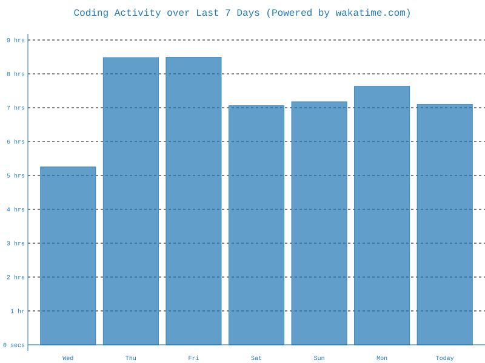

# Hi, I'm Timur 👋

### Software Engineer · Backend & Automation 

---

### 🧭 About Me

- 🚀 Building backends with **Python / FastAPI** and **Go**, working with **Kafka/RabbitMQ**, **PostgreSQL** and **Redis**
- 🎭 Automating processes and testing with **Playwright** with patches
- 📱 In my free time, I tinker with iOS/Android reverse engineering. And of course Leetcode :)
- 💬 Open to interesting projects and collaborations

---

## 🌐 Socials

---

## 💻 Tech Stack

**Languages**

**Frameworks & Tools**

**Data & Messaging**

 

---

## 📊 GitHub Stats

---

## 🐍 Contribution Snake

<picture>
  <source media="(prefers-color-scheme: dark)" srcset="https://raw.githubusercontent.com/forbxpg/forbxpg/output/snake-dark.svg" />
  <source media="(prefers-color-scheme: light)" srcset="https://raw.githubusercontent.com/forbxpg/forbxpg/output/snake.svg" />
  
</picture>

---

## ⏱️ WakaTime

---

## 🥷🏻 LeetCode

